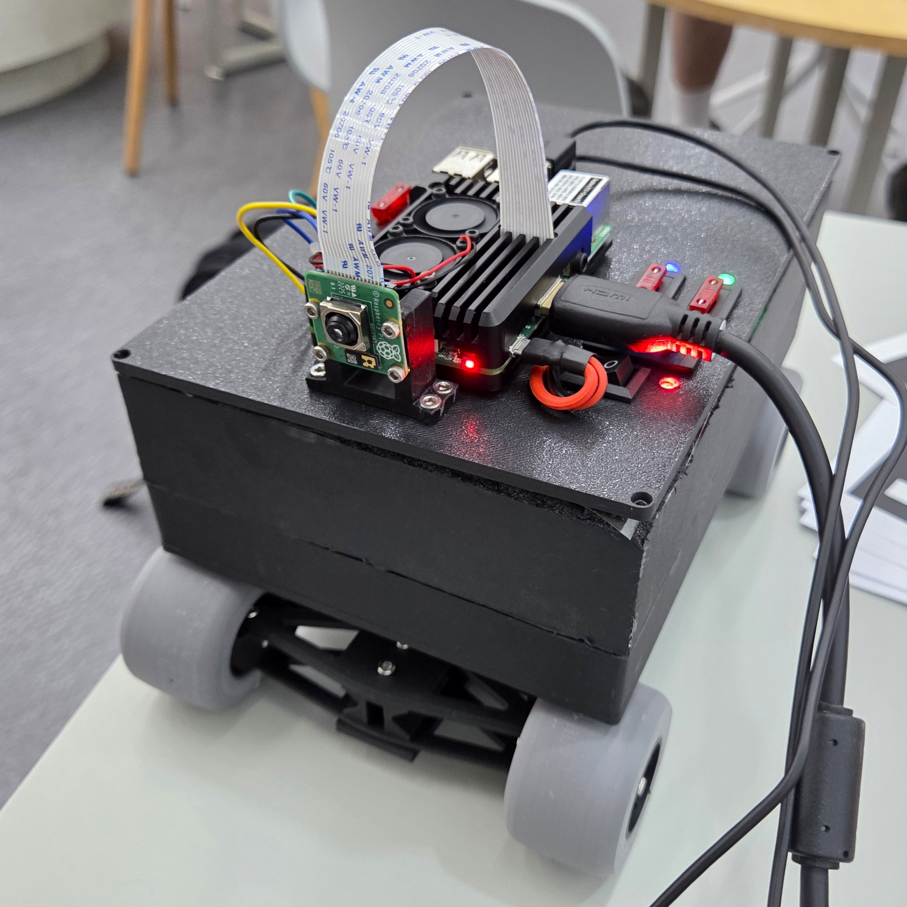
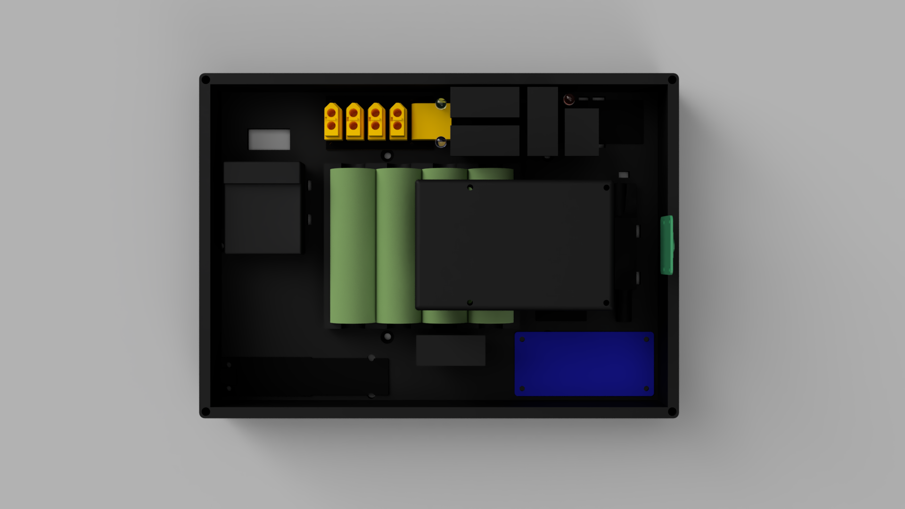
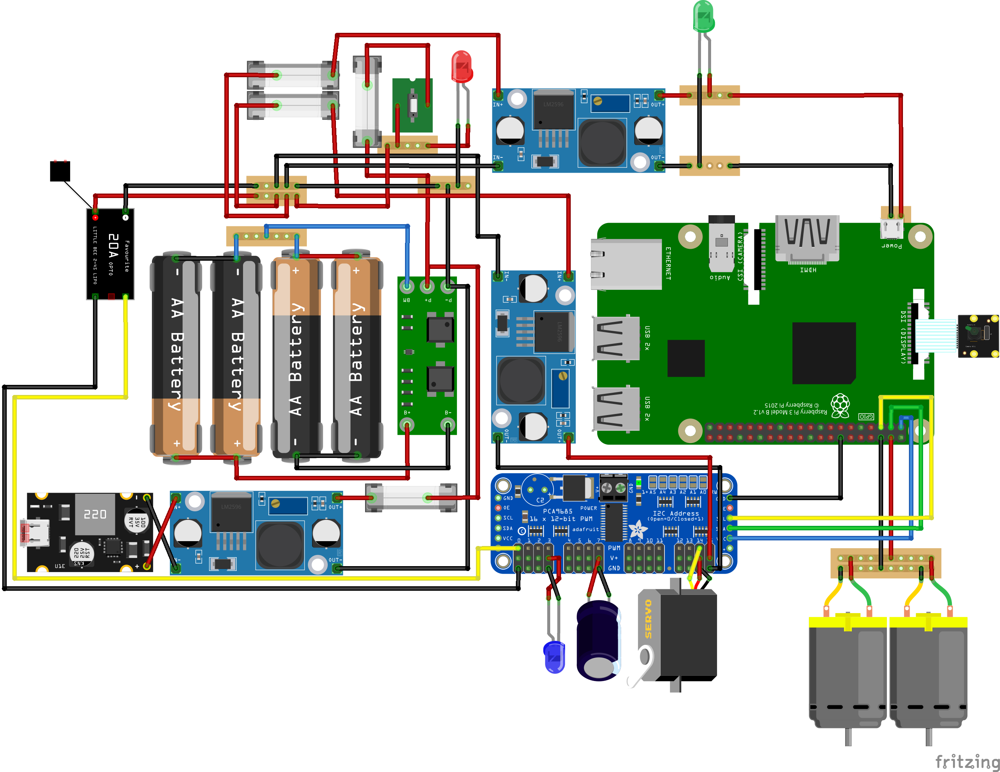
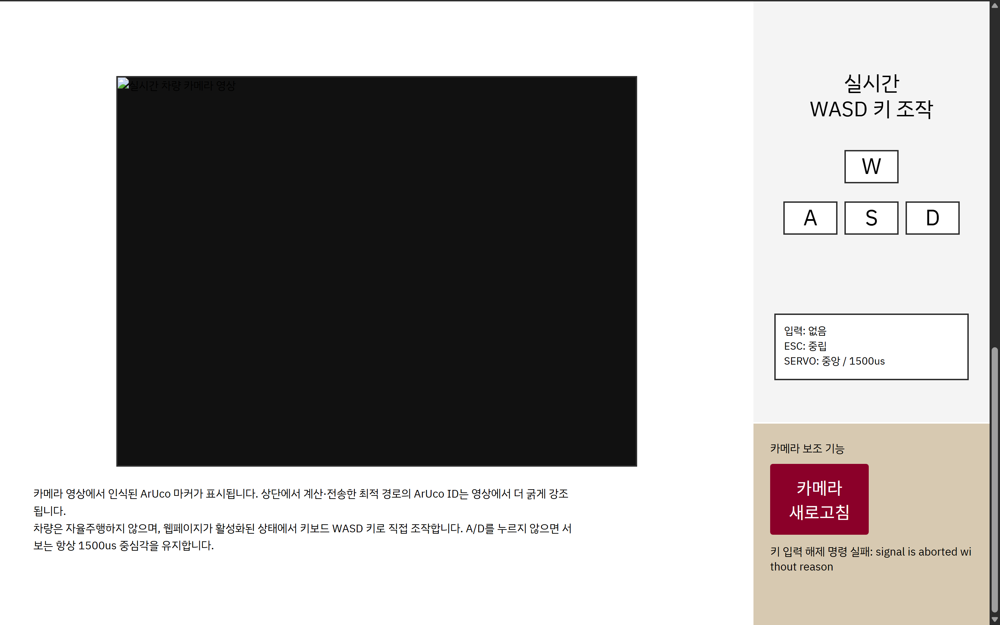

## 1. 프로젝트 개요
이 프로젝트는 전원 분배, PWM 기반 모터 및 조향 제어, 카메라 기반 ArUco 마커 감지, 웹 기반 제어 인터페이스를 통합한 소형 임베디드 차량 플랫폼을 구현합니다.

주요 목표는 하드웨어와 소프트웨어가 통합된 시스템을 설계하고 테스트하는 것이었습니다.  
이 프로젝트는 전원 안정성, 액추에이터 제어, 웹-차량 통신에 중점을 두었습니다.

## 2. 프로젝트 사진
### 차량 프로토타입

### 회로 구성요소 배치

### 회로도

### 웹 UI

## 3. 주요 특징
- 라즈베리 파이 기반 차량 제어 서버
- PCA9685를 통한 ESC 및 조향 서보용 PWM 제어
- 전압 변환 및 퓨즈 보호 기능을 갖춘 배터리 구동형 하드웨어 시스템
- 경로 설정을 위한 웹 기반 그리드 맵 인터페이스
- WASD 수동 제어 인터페이스
- 카메라 기반 ArUco 마커 감지

## 4. 시스템 흐름도
웹 인터페이스  
|  
| HTTP / WebSocket  
v  
라즈베리 파이 3 모델 B  
|  
| I2C  
v  
PCA9685 PWM 드라이버  
|  
| PWM 신호  
|  
|------------------> ESC --> DC 모터  
|  
|------------------> 조향 서보 

 

카메라 모듈  
|  
v  
OpenCV / ArUco 마커 감지 

 

배터리 팩  
|  
|----> 강압 모듈 / UBEC ---> 라즈베리 파이, 서보, PWM 드라이버  
|  
|----> ESC ---> DC 모터

## 5. 하드웨어 구성 요소
### 연산 및 감지 장치
| 구성 요소 | 사양 | 역할 |
|----------------------|-------------|--------------|
| 라즈베리 파이 3 모델 B | 5 V, 2.5 A | 메인 컨트롤러 |
| 라즈베리 파이 카메라 모듈 3 | CSI-2 카메라 | ArUco 마커 인식 |
| 강압 모듈 | 5 V 출력 | 안정적인 전력 변환 |

### 구동 장치
| 구성 요소 | 사양 | 역할 |
|---------|--------------------|--------------------------|
| PCA9685 | 16채널 PWM 드라이버 | 서보 및 ESC PWM 신호 생성 |
| DC 모터 | 7.2 V, 2.3 A | 후륜 구동 |
| ESC | 2 - 3 S | DC 모터 속도 제어 |
| 서보 모터 | 7.4 V | 전륜 조향 제어 |
| UBEC | 2 - 8 S, 5 - 7.4 V 출력 | 안정적인 전력 변환 |

### 전원 공급 및 충전 장치
| 구성 요소 | 사양 | 역할 |
|-----------|-----------------|--------|
| 배터리 팩 | 2S2P 배터리 구성 | 주 전원 |
| BMS | 2S, 8.4 V, 20 A | 배터리 보호 |
| 충전 모듈 | 1 - 4 S, 5 - 26 V 입력 | 배터리 충전 |
| USB-C PD 트리거 모듈 | 20 V PD 출력 | 전원 공급 |

### 보조 부품
| 부품 | 사양 | 역할 |
|--------------------------|-------|-------------------|
| 배전판 | 200 A | 전력 분배 |
| 커패시터 | 1000 µF | 전압 강하 방지 |
| 블레이드 퓨즈 | 전류 경로에 따라 정격 설정 | 과전류 보호 |
| LED(빨강 / 초록, 파랑)    | 2.2 V / 3.2 V, 20 mA | 상태 표시기 |
| 육각 나사 | M3, 8 mm / 10 mm / 12 mm | 장치 조립 |
| 너트 | M3 | 장치 조립 |

## 6. 전원 설계
전원 시스템은 각 장치의 부하 요구 사항을 분리하여 설계되었습니다.

- 라즈베리 파이는 정전압 5 V 전원 공급 장치로 전원을 공급받습니다.
- 조향 서보는 전압 강하를 줄이고 안정적인 전류를 공급하기 위해 UBEC를 통해 전원을 공급받습니다.
- DC 모터는 ESC를 통해 전원을 공급받습니다.
- LED는 전류 제한 저항과 함께 연결됩니다.
- 퓨즈는 각 전원 분기의 예상 전류에 따라 배치됩니다.

### 부하 측 전력 예산
| 부하 | 전압 | 전류 | 예상 전력 | 계산 |
|-----------------------|-----|-------|---------|---------|
| 라즈베리 파이 3 모델 B | 5 V | 2.5 A | 12.50 W | 5 × 2.5 |
| 서보 모터 | 7.4 V | 3.4 A | 25.16 W | 7.4 × 3.4 |
| DC 모터 | 7.2 V | 2.3 A | 16.56 W | 7.2 × 2.3 |
| LED(빨강 / 초록, 파랑) | 2.2 V / 3.2 V | 20 mA | 0.044 W / 0.064 W | 2.2 × 0.02 / 3.2 × 0.02 |

### 주요 부하 소계
| 분기 | 부하 측 전력 | 가정 효율 | 배터리 측 전력 | 계산 |
|-----------------------|---------|-----|---------|--------------|
| 라즈베리 파이 3 모델 B | 12.50 W | 85% | 14.71 W | 12.50 / 0.85 |
| 서보 모터 | 25.16 W | 85% | 29.60 W | 25.16 / 0.85 |
| DC 모터 | 16.56 W | 직접 | 16.56 W | 16.56 |
| LED | 0.172 W | - | 0 W(너무 작음) | - |
| 합계(LED 제외) | 54.22 W | - | 60.87 W | 14.71 + 29.60 + 16.56 |

### 배터리 측 전력 예산
| 배터리 상태 | 배터리 전압 | 예상 배터리 측 전력 | 예상 전류 | 계산 |
|-----------|-------|---------|--------|--------------------|
| 완충 | 8.4 V | 60.87 W | 7.25 A | 60.87 / 8.4 = 7.25 |
| 정격 | 7.4 V | 60.87 W | 8.23 A | 60.87 / 7.4 = 8.23 |
| 방전 | 6.0 V | 60.87 W | 10.15 A | 60.87 / 6.0 = 10.15 |

### 퓨즈 선정
| 퓨즈 위치    | 전류 기준 |    권장 퓨즈 |
|-------------------|-----------------------------|---------------------|
| 주 배터리 회로    | 정상 전류 약 8–10 A |    15 A 느린 퓨즈 |
| 충전 회로    | 1–4 A 충전 전류 | 4 A 충전용 5 A 퓨즈 / 1 A 충전용 2 A 퓨즈 |
| 라즈베리 파이 5 V 분기 회로    |    5 V, 2.5 A | 3 A 퓨즈 |
| 서보 / PCA9685 전원 분기 | 7.4 V, 3.4 A | 5 A 퓨즈 |

### BMS 선정
| 항목 | 기준 | 권장 사양 |
|------------|------------------|-----------------|
| 배터리 유형 | 21700 리튬이온 셀 | 2S 리튬이온 BMS |
| 배터리 구성 | 2S2P 팩 | 8.4 V 완전 충전 호환 |
| 정상 전류 요구량 | 약 8–10 A | 최소 20 A 연속 방전 |
| 피크 전류 요구량 | DC 모터 시동 + 서보 부하 | 30 A 연속 방전 권장 |
| 최대 방전 정격 | 모터/서보의 순간 서지 | 40–60 A 최대 방전 권장 |
| 충전 전류 | 2–3 A 충전 분기 | 3–5 A 충전 정격 |
| 셀 밸런싱 | 2개 셀 직렬 연결 | 밸런싱 기능 권장 |

전력 설계는 옴의 법칙, 키르히호프의 법칙 및 기본 회로 이론을 사용하여 검증되었습니다:
- V = I × R (옴의 법칙)
- P = V × I (전력 공식)
- R = (V_supply - V_f) / I (전류 제한 저항)
- I_1 + I_2 + I_3 + ⋯ + I_n = 0 (키르히호프 전류 법칙, KCL)
- V₁ + V₂ + V₃ + ⋯ + V_n = 0 (키르히호프 전압 법칙, KVL)
- I_(총) = I₁ + I₂ + I₃ + ⋯ + I_n (병렬 회로의 전류 합성)
- V_supply = V_1 + V_2 + V_3 + ⋯ + V_n (직렬 회로의 전압 합성)
- C_pack = C_1 + C_2 + ⋯ + C_n (병렬 회로의 정전용량 합성)
- I_cell ≈ I_pack / n (병렬 회로의 전류 분배)
- η = P_out / P_in (전력 변환 효율)

## 7. 모터 및 조향 제어
ESC와 조향 서보는 PCA9685에서 생성된 PWM 신호를 사용하여 제어됩니다.

- ESC 채널: 0
- PWM 주파수: 50 Hz
- 중립 펄스 폭: 1500 µs
- 조향 제어: PWM을 통한 좌/우 각도 조정
- 정지 로직: ESC 신호가 중립 펄스 폭으로 복귀

조향 서보는 활성 조향 명령이 주어지지 않을 때 중립 위치로 복귀하도록 설계되었습니다.

## 8. 주요 소프트웨어 기능
- 차량 명령 전송용 웹 서버
- WASD 키를 이용한 수동 주행 제어
- ESC 및 서보용 PWM 신호 생성
- 카메라 스트리밍
- ArUco 마커 감지
- 비상 정지 및 중립 제어 로직
- 그리드 매핑 파일에서 경로 및 마커 데이터 불러오기

## 9. 제한 사항
- 카메라 인식은 조명 조건에 민감합니다.
- 배터리 전압 강하가 액추에이터의 안정성에 영향을 미칠 수 있습니다.
- 기계적 조향 정밀도는 서보 보정 범위에 따라 제한됩니다.
- 현재 시스템은 소규모 테스트 환경을 위해 설계되었습니다.
- 이 프로젝트는 단순한 경로 탐색 알고리즘(BFS)을 사용합니다.

## 10. 향후 개선 사항
- 조명 제어 및 카메라 노출 설정을 개선합니다.
- 배터리 전압 모니터링 기능을 추가합니다.
- 서보 중심점과 조향 펄스 범위를 더 정밀하게 보정합니다.
- 더 크고 복잡한 트랙에서 시스템을 테스트합니다.
- A* 또는 기타 고급 경로 계획 알고리즘을 적용합니다.

## 11. 팀원 역할
**김민성 [[Seasoning3](https://github.com/Seasoning3)]**
- 회로 설계
- 회로 구성
- 차체 설계
- 차체 제작
- 웹 프로그래밍
- 차량 프로그래밍
- 테스트 환경 제작
- 아카이빙

**박기범 [[gibeom308](https://github.com/gibeom308)]**
- 테스트 환경 제작

**백영재 [[Paek Yeongjae](https://github.com/paekyeongjae)]**
- 테스트 환경 제작

**전승민 [[tmdals914](https://github.com/tmdals914)]**
- 차량 프로그래밍
- 테스트 환경 제작
